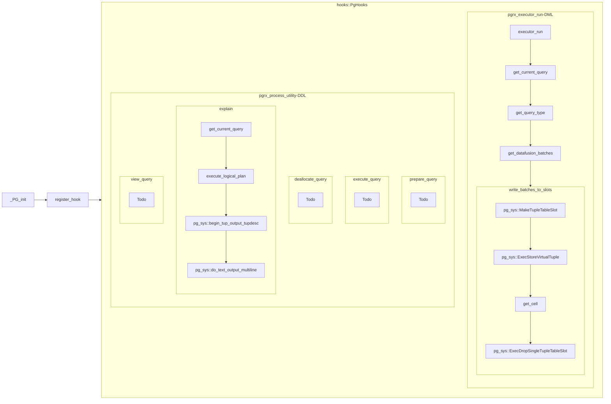

```mermaid
flowchart LR
_PG_init --> register_hook --> hooks::PgHooks
    subgraph hooks::PgHooks
        subgraph write_batches_to_slots
            direction TB
            pg_sys::MakeTupleTableSlot --> pg_sys::ExecStoreVirtualTuple --> get_cell --> pg_sys::ExecDropSingleTupleTableSlot
        end
        subgraph pgrx_executor_run-DML
            direction TB
            executor_run -->  get_current_query --> get_query_type --> get_datafusion_batches -->  write_batches_to_slots
        end
        
        subgraph pgrx_process_utility-DDL
            direction TB
            subgraph prepare_query
                direction TB
                pq[Todo]
            end
            subgraph execute_query
                direction TB
                eq[Todo]
            end
            subgraph deallocate_query
                direction TB
                dq[Todo]
            end
            subgraph explain
                direction TB
                exp1[get_current_query] --> execute_logical_plan --> pg_sys::begin_tup_output_tupdesc --> pg_sys::do_text_output_multiline
            end
            subgraph view_query
                direction TB
                vq[Todo]
            end
        end
        
    end
    
  
```